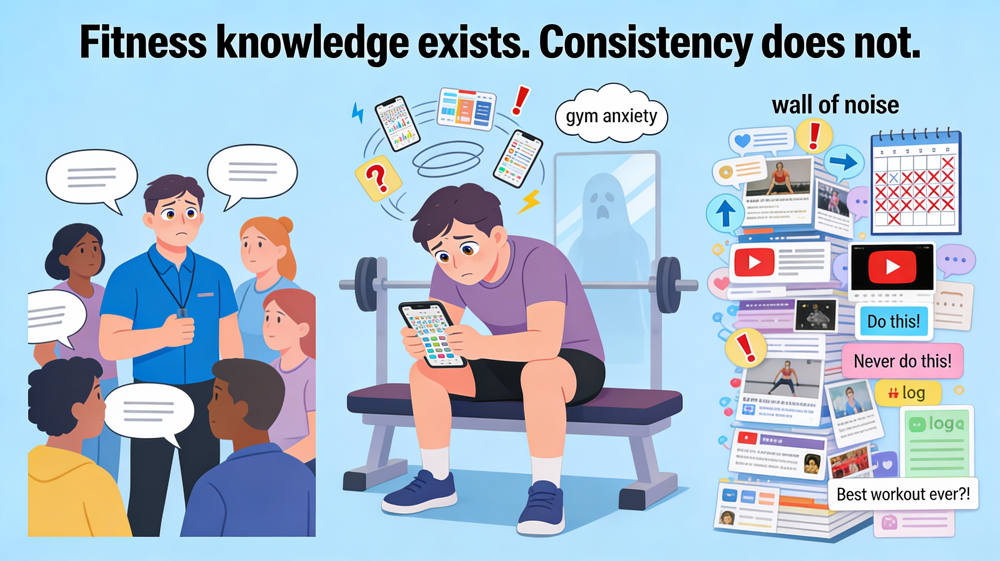
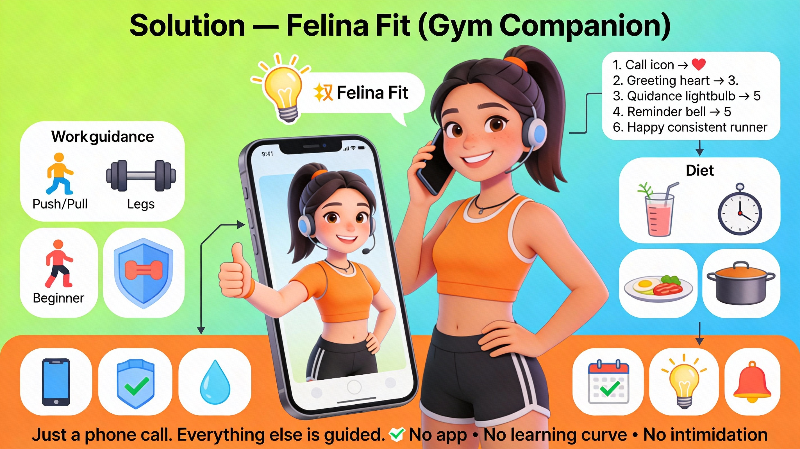

# 🤖 BillianceAI — Felina Fit
### 🏋️ Voice-First AI Gym & Wellness Companion

---
  
## 🚀 Overview

Felina Fit is a voice-first AI assistant designed to help gym members—especially beginners, elders (40+), and busy professionals—manage fitness, diet, and wellness through simple phone calls.
Felina Fit removes dependency on complex fitness apps and replaces them with natural voice conversations for:
- Daily workout guidance
- Weight-loss diet advice
- Protein & nutrition planning
- Cooking tips and habit reminders

---

<table>
<tr>
<td width="50%" align="center" valign="middle">

</td>
<td width="60%" valign="top">

## 🤝 One-line Summary
Felina Fit enables gym members to get daily workout plans, diet advice, and habit reminders through voice calls, helping gyms improve member retention, engagement, and results—without asking users to install or learn new apps.

> **✨ Members speak. Felina guide.**  
> **✨ No apps. No screens. Just a phone call — Felina handles the rest.**

---

## 🎯 Vision
**✨ Help people stay consistent with fitness through simple, human conversations.**  

- What Felina Fit Stands For 
✔ Consistency over complexity 
✔ Voice-first accessibility 
✔ Beginner & elder friendly 
✔ Reduced trainer dependency 
✔ Habit-driven fitness 

**Tagline:**
> **✨ “Just Call. Felina Will Guide.”**

</td>
</tr>
</table>

---

<table>
<tr>
<td width="60%" align="center" valign="middle">

</td>
<td width="60%" valign="top">
  
## 🧠 Problem Statement

**Challenges Faced by Gym Members**
- High Drop-offs Because of:
- Confusing fitness apps
- Information overload
- Inconsistent motivation
- Fear of “doing workouts wrong”

**Dependence on:**
- Trainers for every doubt
- YouTube & conflicting advice

**Emotional Impact:**
- Gym anxiety
- Low confidence
- Poor adherence to diet & workouts

> **✨ Fitness knowledge exists. But Consistency ?**

</td>
</tr>
</table>

---

<table>
<tr>
<td width="50%" align="center" valign="middle">

</td>
<td width="60%" valign="top">
  
## 💡 Solution — Felina Fit (Gym Companion)

**Felina Fit acts as a virtual trainer + diet coach that gym members can call anytime.**

> **✨ “Just a phone call. Everything else is guided.”**

**🏋️ Workout Guidance**
- “What workout should I do today?”
- Push / Pull / Legs suggestions
- Beginner-friendly alternatives
- Injury-aware guidance (knees, back, fatigue)

**🥗 Diet & Weight Loss**
- “What should I eat today for fat loss?”
- Fasting break meals
- Protein calculation
- Outside food guidance

**🍳 Cooking & Nutrition**
- Low-oil cooking tips
- Protein-rich simple recipes
- Late-night & quick meal ideas

**⏰ Habit & Reminder Support**
- Workout reminders
- Protein & water nudges
- Gentle follow-ups after inactivity

</td>
</tr>
</table>

---

<table>
<tr>
<td width="50%" align="center" valign="middle">

</td>
<td width="60%" valign="top">

## 📞 Member Experience Flow
- Member calls Felina Fit
- Felina greets in preferred language
- Member asks naturally
- Felina gives clear guidance
- Optional follow-up reminders
- Member stays consistent

> **✨ No app • No learning curve • No intimidation**

---

## 💬 Sample Conversation

**✨ Greeting & Context**
- Hello Ramesh, this is Felina Fit.
- Did you go to the gym today or are you planning to go now?

**✨ Workout**
- Member: Today is chest day, what should I do?
- Felina: Let’s start with bench press and chest press. I’ll guide you step by step.

**✨ Diet**
- Member: What should I eat for dinner today?
- Felina: Have grilled chicken with vegetables. Avoid oil-heavy foods tonight.

</td>
</tr>
</table>

---

## 🏢 Value for Gyms & Fitness Centers

**💪 For Gym Owners** 
✔ Higher member engagement 
✔ Reduced drop-outs 
✔ Less trainer overload 
✔ Differentiated gym experience 

**🧠 For Trainers** 
✔ Handles repetitive questions 
✔ Frees time for premium coaching 
✔ Standardized guidance 

> **✨ Felina complements trainers — it does not replace them.**

---

## 🌐 Integration Model (Gym-Friendly)

- Gym-specific workout rules
- Trainer-approved diet templates
- Custom gym branding
- Member profiles (optional)
- Multilingual voice support

---

## ⚖️ Ethical & Practical Design

✔ Consent-first interactions
✔ No medical claims
✔ No body shaming
✔ No forced upsells

- Data stored (minimal):
- Name (optional)
- Fitness goal
- Preferred language
- Workout level

**Never stored:**
❌ Health records
❌ Payment details
❌ Behavioral profiling

---

<table>
<tr>
<td width="50%" align="center" valign="middle">

</td>
<td width="60%" valign="top">

## 📊 Market Opportunity

- 100M+ active gym & fitness users in India
- Massive beginner & weight-loss segment
- Low long-term retention across gyms
- High demand for simple guidance

> **✨ Felina Fit turns gyms into habit ecosystems, not just workout spaces.**

---

## 💰 Collaboration & Revenue Model

- 🤝 Gym Partnerships
- 👨‍👩‍👧 Family Wellness Plans
- 🧠 Brand Partnerships

</td>
</tr>
</table>

---

## 🌐 Lead & Outreach Contacts

**🏋️‍♂️ Cult.fit (CureFit) | 💪 Slam Gym | ⏱️ Anytime Fitness -** [**Link**](https://github.com/Raguram-N/-Felina-fit-collab/blob/main/README.md)

---

## ⭐ Why Felina Fit Wins

- Voice-first by default
- Zero app fatigue
- Beginner & elder friendly
- Trainer-aligned logic
- Scalable & cost-efficient
- Improves retention, not just signups

> **✨ This is not another fitness app. It is fitness guidance designed around human behavior.**

---

## ✅ Conclusion

Felina Fit helps gym members stay consistent, confident, and informed—
without screens, pressure, or confusion.

> **✨ One phone call. One trusted voice. Better fitness outcomes.**
